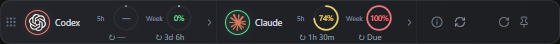

# AgentGlance

A small floating desktop widget for the AI assistants you use. See activity, account usage and reset countdowns in a **44-pixel toolbar**, then expand an assistant to inspect context for individual tasks.

Version **2.1.1** · [Ricko-Shaha/AgentGlance on GitHub](https://github.com/Ricko-Shaha/AgentGlance)



*Example data. Task context is collapsed by default.*

[Install](docs/INSTALLATION.md) · [Usage guide](docs/USAGE.md) · [Supported providers](docs/PROVIDERS.md) · [Troubleshooting](docs/TROUBLESHOOTING.md) · [Development](docs/DEVELOPMENT.md) · [Privacy](docs/PRIVACY.md)

## What it shows

- **Activity lights around real provider logos:** green for free, red for occupied, yellow for waiting, gray for unknown.
- **Account usage:** separate circular meters for reported five-hour and weekly limits, with reset countdowns and exact times on hover.
- **Task context:** independent, collapsed task lists with saved titles and each task's reported token usage and capacity.
- **Only detected connections:** supported local CLI sign-ins or configured API credentials. No separate widget account.
- **Desktop controls:** drag, pin, minimize, tray restore, layout switching, and recovery from taskbar or display-edge drops.

Prefer a vertical taskbar? Switch to the **44 × 560 pixel rail**. Tasks, usage details, and Info open in a drawer to its right, expanding the window to 360 pixels wide while keeping it inside the usable desktop.

Usage colors indicate the percentage **used**: green below 50%, yellow from 50%, orange from 75%, red from 90%. Activity and quota colors are independent. Missing measurements remain unavailable.

## Provider support

| Assistant or provider | Connection discovery | Activity | Account limits / task context |
| --- | --- | --- | --- |
| Codex | Local credentials or CLI authentication status | Task lifecycle observations | Reported limits, resets and per-task metadata |
| Claude Code | Local credentials or CLI authentication status | Optional activity hooks | Status-line telemetry; partial fallbacks |
| Kimi Code | Supported credential files | Process presence only | Unavailable |
| Gemini CLI | Local OAuth credentials | Process presence only | Unavailable |
| OpenCode | Local provider credentials | Process presence only | Unavailable |
| Qwen Code | Selected API configuration and credential | Process presence only | Unavailable |
| GLM / Z.ai | Supported OpenCode or Claude Code provider configuration | Unknown: shared CLI | Unavailable |
| DeepSeek | Supported OpenCode or Claude Code provider configuration | Unknown: shared CLI | Unavailable |

An open process alone does not mean an assistant is generating. Configured credentials are local connection evidence, not a server-side validation of an account or subscription. GLM and DeepSeek do not receive a copy of Claude's processes, quotas or task context. See [provider details and configuration paths](docs/PROVIDERS.md).

## Get started

1. Authenticate in a supported CLI under your usual operating-system user.
2. Install and open the widget using the [installation guide](docs/INSTALLATION.md).
3. Existing supported credentials are discovered automatically.
4. For fuller Claude activity and context, use **Info → Claude telemetry → Connect Claude** from an installation at a stable location.

You do not paste credentials into the widget. Full telemetry is not universally zero setup: Claude's optional connection installs local observers, and several providers do not expose supported usage data. Windows portable builds and Linux AppImages cannot install the new Claude observer.

For a source checkout:

```sh
npm ci
npm run dev
```

Development requires Node.js 22.12+; CI uses Node.js 24. Packaged applications include their runtime.

## Desktop availability

| Platform | Package targets | Validation |
| --- | --- | --- |
| Windows x64 | Portable EXE, installer | Local and native CI checks passed |
| macOS Intel / Apple Silicon | DMG, ZIP | Native CI checks passed |
| Linux x64 / arm64 | AppImage, DEB | Native CI checks passed |

[Version 2.1.1 passed all five native CI jobs](https://github.com/Ricko-Shaha/AgentGlance/actions/runs/36693234631): unit tests, interface build, desktop checks, packaging and packaged-window checks. Linux desktop checks use X11 with Openbox; pure Wayland and every desktop environment have not been validated. The [desktop workflow](.github/workflows/desktop.yml) uploads the resulting packages as artifacts. It does not automatically publish GitHub Releases. Windows packages are unsigned; macOS signing is ad hoc, without notarization.

AgentGlance was previously named Statusline. Existing `STATUSLINE_*` environment variables and `statusline-*` Claude integration directories retain their compatibility names; see [upgrading from Statusline](docs/INSTALLATION.md#upgrading-from-statusline).

On Linux, X11/XWayland provides the floating toolbar. Pure Wayland without an X11 display uses a framed vertical window with compositor-controlled positioning. See [platform setup and limitations](docs/INSTALLATION.md).

## Data and project information

Credentials stay in the backend. The widget reads local authentication and selected session metadata; supported usage lookups contact the providers through their authenticated interfaces. There is no analytics service. Saved task titles can contain private information, so review screenshots before sharing them. See [Privacy](docs/PRIVACY.md) for sources, storage and the optional Claude integration.

[Contributing](CONTRIBUTING.md) · [Changelog](CHANGELOG.md) · [Security reporting](SECURITY.md) · [Logo attribution](assets/logos/README.md)

This project is independent of the displayed AI providers. Their names and logos belong to their respective owners. No project-wide open-source license has been selected yet; third-party assets and dependencies retain their own terms.
